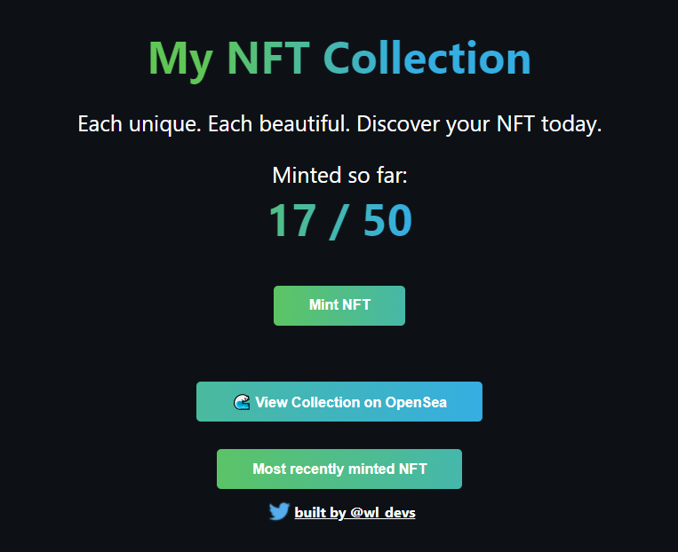

# Mint NFTs

This project explores how to mint NFTs. The NFTs generated from this project create an SVG image with an animated background and a randomly generated name mix of Star Wars characters. The contract limits up to 50 NFTs to be minted.

[Link to live demo](https://nft-starter-repo-final.wleung85.repl.co/)

[Link to NFT collection on OpenSea](https://testnets.opensea.io/collection/squarenft-mrty74bp3f)

To test contract with run script:
`npx hardhat run scripts/run.js`

To deploy contract on Rinkeby:
`npx hardhat run --network rinkeby scripts/deploy.js`

Project created with buildspace.

## What the app looks like with the frontend:
**Before connecting MetaMask wallet**

**After connecting MetaMask wallet**

**After minting an NFT**

**Minted NFT seen on Rarible**

