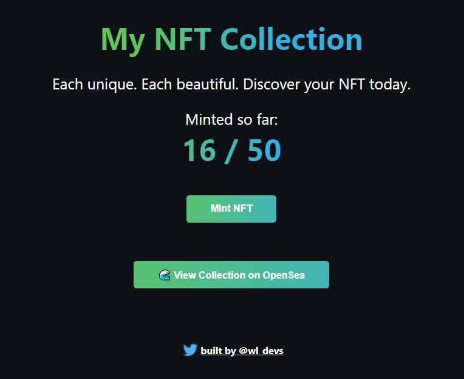

# Mint NFTs

This project explores how to mint NFTs. The NFTs generated from this project create an SVG image with an animated background and a randomly generated name mix of Star Wars characters. The contract limits up to 50 NFTs to be minted.

To test contract with run script:
`npx hardhat run scripts/run.js`

To deploy contract on Rinkeby:
`npx hardhat run --network rinkeby scripts/deploy.js`

Project created with buildspace.

What the app looks like with the frontend:

